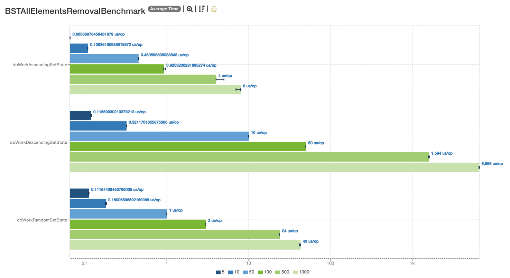
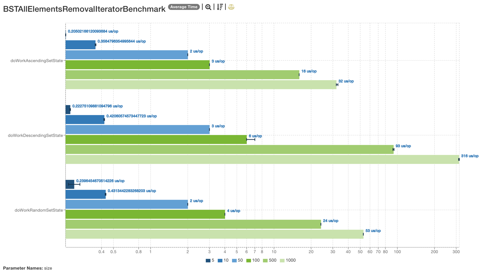
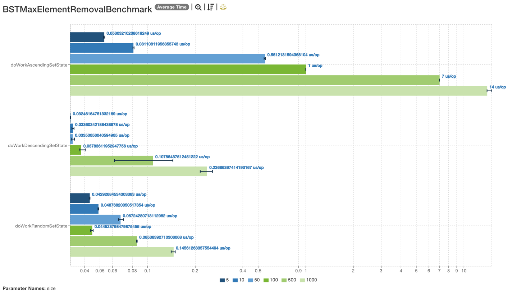
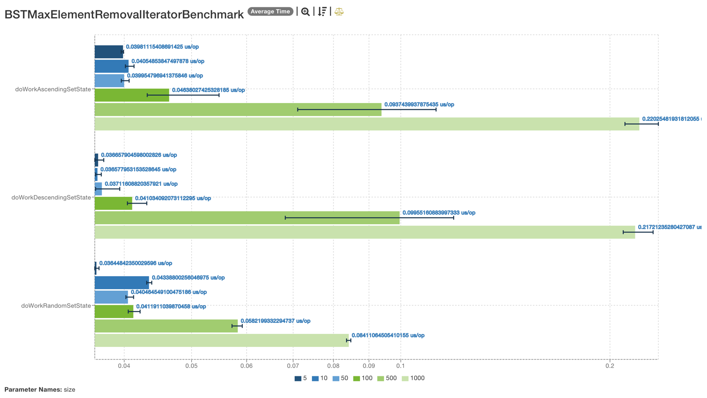
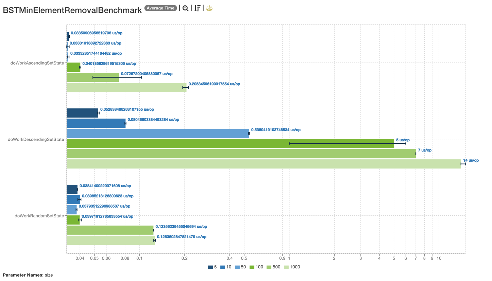
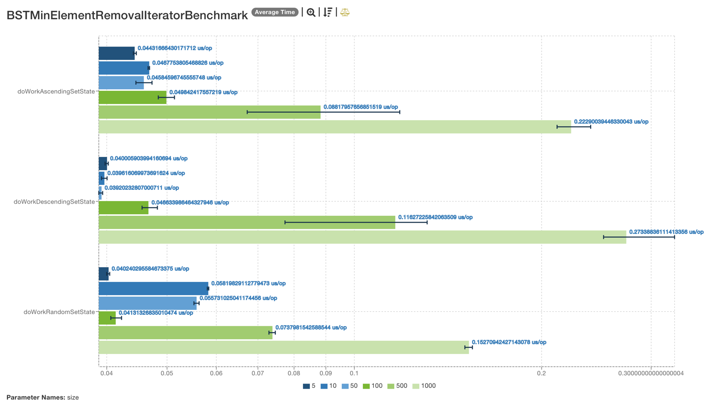
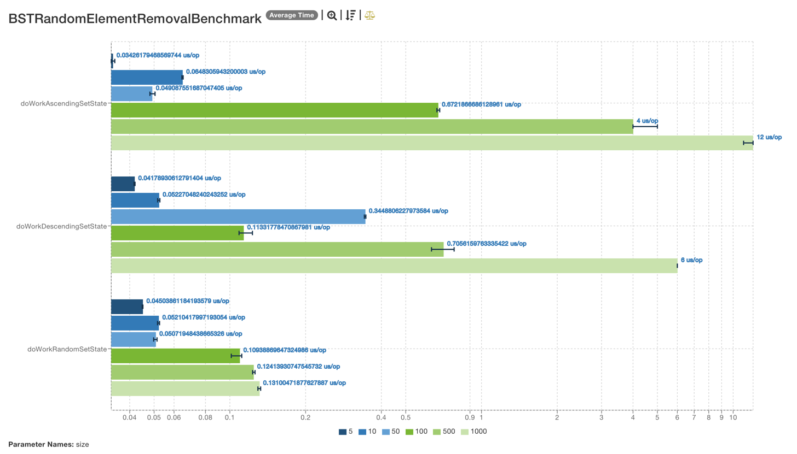
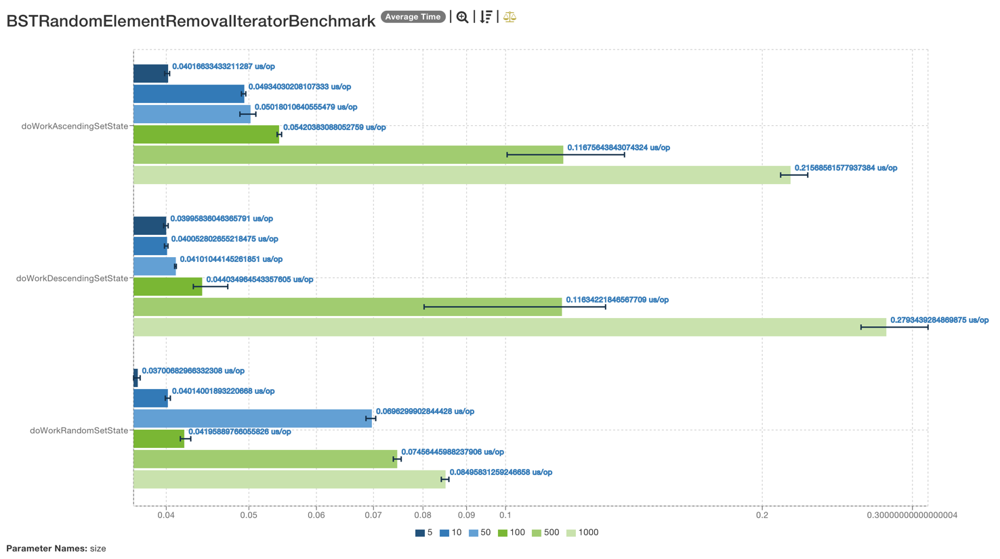

# Binary search tree
## Benchmark with *jmh* of remove operation

Hi there! There are results of performance comparison on remove operation
with iterator or not for BST.

### Implementation notes
1. Remove operation searches the element that falls under deletion and
then just removes it.
2. Iterator's remove works some different. Using `next()` it knows about
the place where element located. And all it needs - just remove the element
and remember parent of removing item for replacement.

* There compared two ways: remove both via `java.util.Set.remove()` and 
via `kotlin.collections.MutableIterator.remove()`
* Each check also compared by set size.
* Each benchmark runs for three types of sets: 
  * **Random** (rather balanced)
  * **Ascending** (it's just a right branch of a tree)
  * **Descending** (it's just a left branch of a tree)
* A *logarithmic* scale is used for charts.

### Let's check difference

#### All elements' removal from the tree (clear)

And via iterator:

#### Max element removal from the tree

And via iterator:

#### Min element removal from the tree

And via iterator:

#### Random removal from the tree

And via iterator:

[JSON with benchmark results](results/results.json)

### How to?

If you want to run the benchmark, 
* Start `./gradlew jmhRun`
