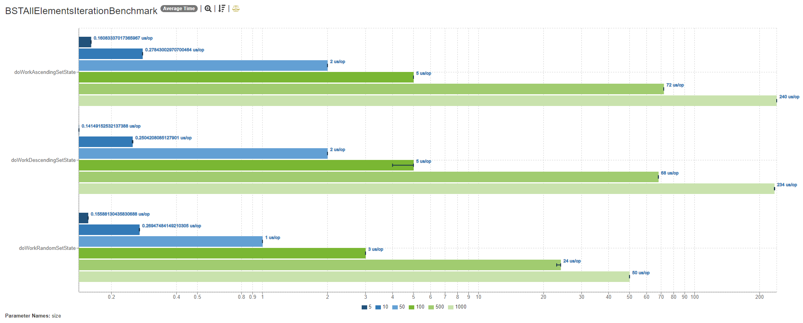
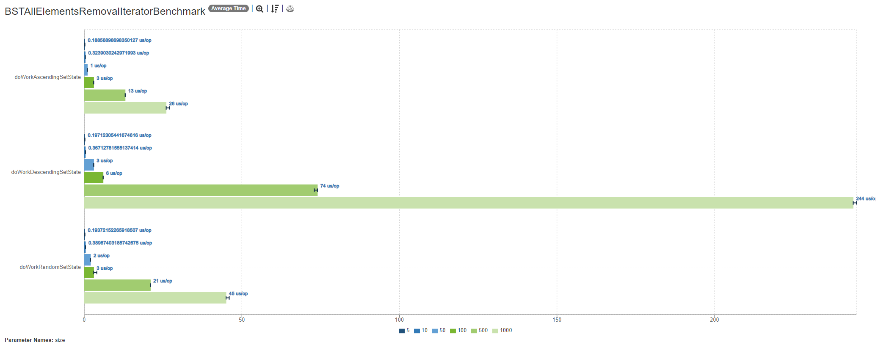

# Binary search tree
## Benchmark with *jmh* of remove operation

Hi there! There are results of performance comparison on remove operation
with iterator or not for BST.

### Implementation notes
1. Remove operation searches the element that falls under deletion and
then just removes it.
2. Iterator's remove works some different. Using `next()` it knows about
the place where element located. And all it needs - just remove the element
and remember parent of removing item for replacement.

* There compared two ways: remove both via `java.util.Set.remove()` and 
via `kotlin.collections.MutableIterator.remove()`
* Each check also compared by set size.
* Each benchmark runs for three types of sets: 
  * **Random** (rather balanced)
  * **Ascending** (it's just a right branch of a tree)
  * **Descending** (it's just a left branch of a tree)
* A *logarithmic* scale is used for charts.

### Let's check difference

#### All elements' removal from the tree (clear)

And via iterator:

#### *What does it mean?*
* **iterator-less** remove is good for ascending BST because node to be removed shouldn't be found.
It's root every time.
* But for descending BST **iterator-less** remove is the worst case can be: 
node to be removed is looked up each time, and each time it is the furthest node from the root.
* With random configuration of BST **iterator-less** remove time it spent is acceptable.
 
As for BST clear **via iterator** we can see worse result compared to similar operations
with **iterator-less** way. It's due to iterate reasons. With `next()` operation 
also stack popping/pushing performed to match iteration order.
* **iterator** remove for ascending BST is much worse due to reasons of *node to be removed*
location is always known for **iterator-less** way.
* But as for remove **via iterator** and *descending* BST case, it's even much better than similar
case for **iterator-less** because get next element to be removed is simpler with stack operations
of iterator.

* **Important notice**: For *random BST structure* digits for **iterator-less** case is better,
but it's a result of lack of iteration through tree elements (elements to be removed are derivable
with assistance O(1) complexity for each one via `ArrayList`).

Let's see time spent for iteration in comparison with clearing set with iterator:
- Iteration:

- Clear with iterator

And we can notice that almost all tree cleanup time is spent iterating for **descending**
and **random** configurations trees.
#### Max element removal from the tree

And via iterator:

#### Min element removal from the tree

And via iterator:

Max and min elements' removal is described in the cases above.

#### Random removal from the tree

And via iterator:

As for random element removal from the BST, doing it with 
**iterator** <u>more productive</u> and <u>faster</u> than **without iterator** for edge cases 
and <u>some better</u> another cases.

[JSON with benchmark results](results/results.json)

[JSON with benchmark and comparison of all-set iterating and clearing set results](results/iteration_and_clear_results.json)

### How to?

If you want to run the benchmark, 
* Start `./gradlew jmhRun` and wait for results in *standard output stream* and in `build/results/jmh` folder as *.json*.
